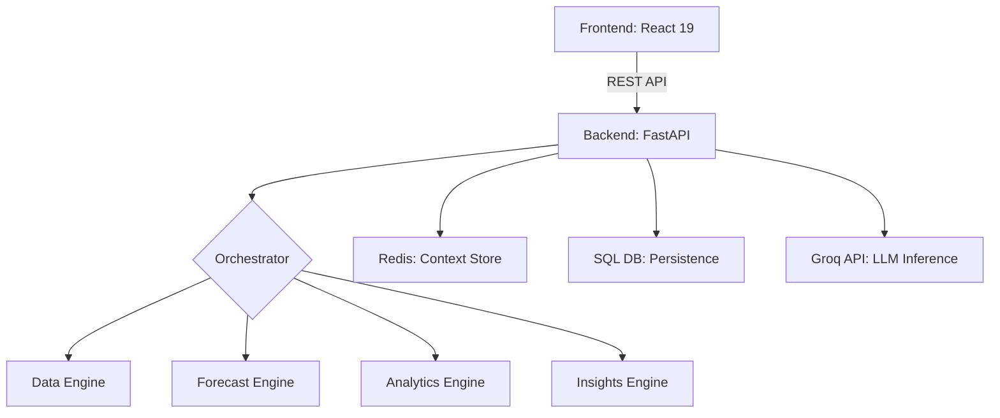

# Business Intelligence AI Copilot

## Overview
Business Intelligence AI Copilot is an enterprise-grade, agentic analytics platform designed to transform raw datasets into strategic narratives. By combining a multi-engine backend with a high-performance React dashboard, the system provides real-time data storytelling, predictive forecasting, and automated professional reporting through an intuitive natural language interface.

## Problem Statement
The current data analytics landscape is polarized between two extremes:
1.  **Overly Technical BI**: Tools like Tableau or PowerBI require specialized training, complex data modeling, and manual dashboard construction.
2.  **Basic AI Chatbots**: Generic LLMs lack the domain-specific statistical engines and real-time data context needed for precision analytics.

Business Intelligence AI Copilot solves this by providing an **autonomous analytical layer** that bridges the gap, allowing users to query their data naturally while receiving mathematically sound, context-aware insights.

## Target Audience
*   **Strategic Leaders (CXOs)**: Who need high-level KPIs and automated executive summaries without navigating complex menus.
*   **Operational Managers**: Who require root cause analysis (RCA) on performance anomalies to optimize workflows.
*   **Business Analysts**: Who seek to automate the "exploratory" phase of data analysis and generate draft reports instantly.
*   **Financial Controllers**: Who utilize the predictive forecasting engine for budget planning and trend projection.

## Key Features
*   **Agentic Orchestration Pipeline**: A sequential processing flow that automatically cleans data, generates forecasts, and extracts insights upon upload.
*   **Context-Aware AI Chat**: A persistent chat system that "remembers" the specific nuances of the active dataset and previous user queries.
*   **Predictive Forecasting Engine**: Built-in time-series modeling that projects future performance metrics based on historical data patterns.
*   **Automated Document Generation**: One-click professional PDF export system that compiles charts, summaries, and anomaly logs into a structured report.
*   **Dynamic Visualizations**: Responsive, SVG-based interactive charts that update in real-time based on the filtered dataset context.
*   **Anomalies & RCA**: Automatic detection of data outliers with AI-generated explanations of the "why" behind the numbers.

## Comparison Table

| Feature | Traditional BI (Tableau/PowerBI) | Generic AI Chat (ChatGPT) | **Business AI Copilot** |
| :--- | :--- | :--- | :--- |
| **User Interface** | Drag & Drop / Technical | Text Only | **Contextual Chat + Dashboard** |
| **Analytical Logic** | Manual SQL/Calculations | Probabilistic Guessing | **Deterministic Statistical Engines** |
| **Forecasting** | Requires Manual Modeling | Inaccurate / Hallucinated | **Native Forecast Pipeline** |
| **Data Context** | Static | Limited / No Privacy | **Persistent & Isolated Context** |
| **Reporting** | Manual PDF Printing | None | **Automated Professional Exports** |

## Technical Design & System Architecture

### 1. High-Level Architecture
The system follows a **Decoupled Monorepo Architecture** with a clear separation between the presentation layer and the analytical backend.



### 2. Analytical Pipeline (The Working)
When a user uploads a dataset, the **Orchestrator** initiates a sequential four-stage pipeline:
1.  **Ingestion & Normalization (Data Engine)**: Standardizes timestamp formats, handles missing values, and infers dataset frequency (daily, weekly, etc.).
2.  **Predictive Modeling (Forecast Engine)**: Executes time-series algorithms (e.g., Prophet or similar) to generate future `yhat` values based on the historical `ds` and `y` columns.
3.  **Statistical Synthesis (Analytics Engine)**: Computes growth rates, volatility, seasonality, and detects anomalies. It bridges historical data with forecasted projections to provide a holistic view.
4.  **Narrative Generation (Insights Engine)**: Maps the raw statistical results to natural language templates, creating the initial "Executive Summary" seen on the dashboard.

### 3. Contextual Chat System
The chat system is decentralized and leverages a hybrid storage model:
*   **System Context**: The backend compiles a "System Prompt" by merging the latest Analytics and Insights data into a highly structured context string.
*   **State Persistence**: Active conversation history and dataset context are cached in **Redis** with a sliding expiration, ensuring sub-second response times for subsequent queries.
*   **Inference Layer**: Uses the **Groq API** (Llama-3 based models) for near-instantaneous natural language processing, allowing the AI to answer specific questions about the data with 100% contextual accuracy.

### 4. Professional Reporting Logic
The PDF export system utilizes a dual-layer rendering strategy:
*   **Layer 1 (html2canvas)**: Captures high-fidelity snapshots of the dynamic Recharts components and dashboard KPIs.
*   **Layer 2 (jsPDF)**: Constructs a multi-page document, injecting the captured images alongside structured text, tables, and metadata for a print-ready executive report.

## Technical Stack

### Frontend
*   **React 19**: Leveraging the latest concurrent rendering features and hooks.
*   **Vite**: For ultra-fast development builds and optimized production assets.
*   **Tailwind CSS 4**: Utilizing the new JIT engine for a premium design system.
*   **TanStack Query**: Managing server-state, caching, and optimistic UI updates for the chat.
*   **Framer Motion**: For fluid layout transitions and interactive UI elements.
*   **Recharts**: For performant, SVG-based data visualizations.

### Backend
*   **FastAPI**: A modern, high-performance Python framework for building APIs.
*   **SQLAlchemy**: A powerful ORM for secure and scalable database interactions.
*   **Pandas**: For heavy-duty data manipulation and statistical processing.
*   **Redis**: For high-speed session management and AI context caching.
*   **Groq SDK**: For low-latency LLM inference.

## Implementation Details & Security
*   **Data Isolation**: Every dataset is isolated at the database level with UUID-based referencing.
*   **Role-Based Access (RBAC)**: Integrated authentication ensures that only authorized users can access specific datasets or generate reports.
*   **Stateless Scaling**: The API-first design allows the system to scale horizontally, with Redis handling the transient state between nodes.

## Getting Started

### Prerequisites
*   Node.js (v20+)
*   Python (3.10+)
*   Redis (For context persistence)
*   Groq API Key (For AI Chat)

### Installation

#### Frontend
```bash
cd frontend
npm install
npm run dev
```

#### Backend
```bash
cd backend
python -m venv venv
source venv/bin/activate # or venv\Scripts\activate on Windows
pip install -r requirements.txt
python app.py
```

## Production Deployment

In a production environment, the FastAPI backend is configured to serve the built frontend assets. This simplifies deployment by requiring only a single port to be exposed.

### 1. Build the Frontend
Navigate to the frontend directory and generate the production bundle:
```bash
cd frontend
npm install
npm run build
```
This creates a `dist/` directory containing optimized static assets.

### 2. Configure Backend
Ensure the `STATIC_DIR` in `backend/core/config.py` points to the `frontend/dist` directory (default: `../frontend/dist`).

### 3. Run the Unified Server
Start the backend server, which will now automatically serve the frontend on the root URL:
```bash
cd backend
python app.py
```

## Future Roadmap
*   **Multi-Source Ingestion**: Integration with SQL databases, Shopify, and Google Sheets.
*   **Agentic Tools**: Allowing the AI to perform "on-the-fly" data filtering and custom grouping.
*   **Advanced RCA**: More granular attribution modeling for performance drops.
